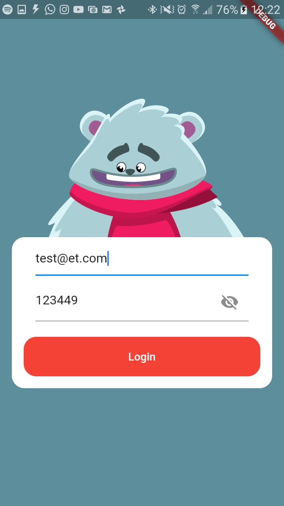

# login_flare

&#x27;A new Flutter project. Created by Slidy&#x27;

## FLARE

This project using bloc for manage the state of animations with Flare. The example using Teddy bear in a login form where manage some possible states like typing password, email and submit (sucess and fail).

## LOGIN-FORM

The validations of form is made with bloc and external libraries. 

